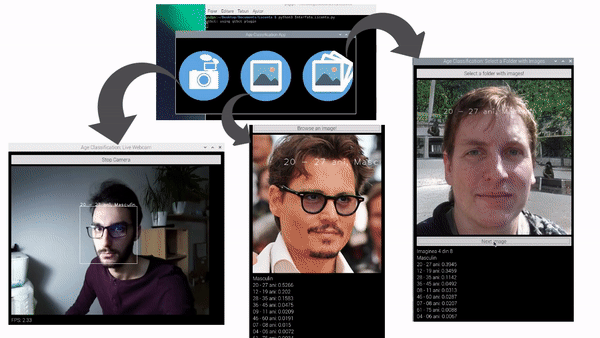
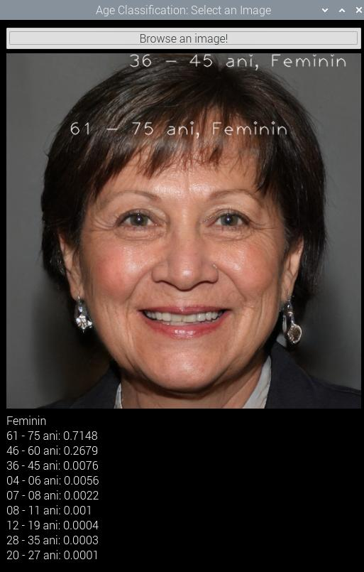
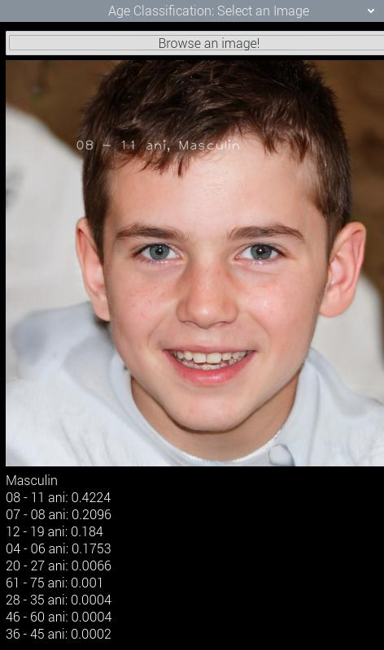
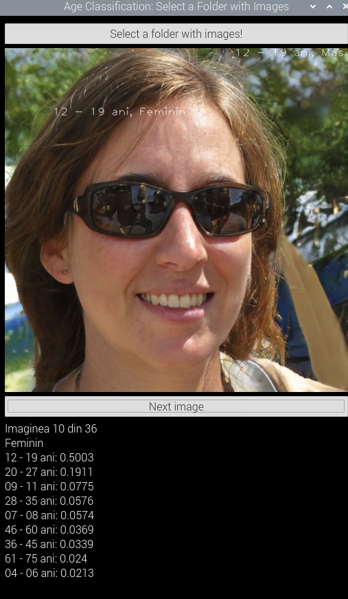
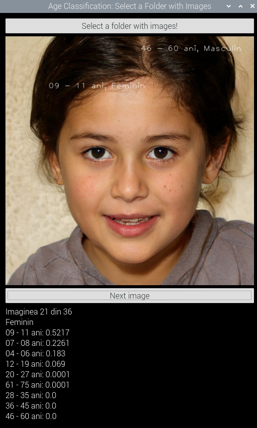
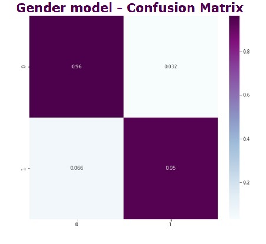
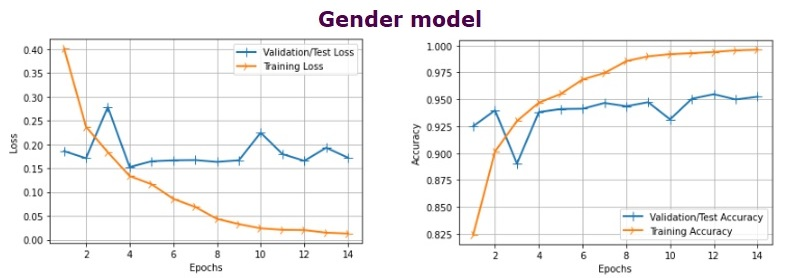

# Real-Time Age and Gender Classification on RaspberryPi4 using TFLite and PyQt5 Interface
Automatic age and gender classification in real-time, using Convolutional Neural Networks (based on MobileNet v1 network), fitted on Raspberry Pi 4 model using a converted .tflite model. The application is wrapped in a simple and modern UI using PyQt5.

## Contents:
* [Demo](#Demo)
* [Screenshots](#Screenshots)
* [About this App](#AboutApp)
* [About the Model used](#AboutModel)
* [App main features](#AppFeatures)
* [Requirements](#Requirements)
* [Installation Process](#Installation)
* [License](#License)

## Demo

## Screenshots

  
  
  

  
  
  

* These images are downloaded from [ThisPersonDoesNotExist.com](https://thispersondoesnotexist.com). These people do not exist in reality, they were generated using a [Generative Adversarial Network - GAN](https://en.wikipedia.org/wiki/Generative_adversarial_network).

## About this App
Automatic age and gender classification can be used in a large number of applications, especially in intelligent human-computer interfaces, as well as in biometrics, visual surveillance, limited access to multimedia content, and for commercial applications such as self-checkouts.

This app is proposed to be an optimal solution for the classification of age and gender in real-time, using a limited resource platform (Raspberry Pi 4 system), which does not have graphical acceleration. The app uses Convolutional Neural Networks (CNNs) in order to predict the classes. The network used is MobileNet v1 with 4 Million parameters, which is optimal in terms of resources used (compared to other CNN networks, see the table I made below).

|   ARCHITECTURE  | TOP 1 ACCURACY | NUMBER OF PARAMETERS | SIZE (MB) | YEAR |
|:---------------:|:--------------:|:--------------------:|:---------:|:----:|
| MobileNet-224   |      0.706     |          4M          |     16    | 2017 |
| Inception V1    |      0.698     |          5M          |           | 2014 |
| Inception V2    |      0.748     |          11M         |           | 2015 |
| Xception        |      0.790     |          22M         |     88    | 2016 |
| Inception V3    |      0.779     |          23M         |     92    | 2015 |
| ResNet-50       |      0.721     |          26M         |     98    | 2015 |
| AlexNet - 7CNNs |      0.633     |          60M         |           | 2012 |
| VGG-16          |      0.744     |         138M         |    528    | 2014 |
| VGG-19          |      0.745     |         144M         |    549    | 2014 |

This was a small part of my final project to obtain my Bachelor's Degree at Faculty of Electronics, UPB, Computer Science department. The final grade for the project was 10/10.

## About the Model used
Classes used:
- 04 - 06 years old
- 07 - 08 years old
- 09 - 11 years old
- 12 - 19 years old
- 20 - 27 years old
- 28 - 35 years old
- 36 - 45 years old
- 46 - 60 years old
- 61 - 75 years old
- female gender
- male gender

The model was trained using MobileNet v1 network using 10k images from UTKFace and Appa-Real databases, along with the following parameters:
- Optimizer: Stochastic Gradient Descent (SGD)
- Batch Size: 2
- Learning Rate: 10e-4
- Accuracy on test: 49.63%
- Accuracy on test with 2 years overlapping limits: 68.82%

  
  

## Requirements
* Raspberry Pi 3 or 4 or Any Linux System based on ARM chip with at least 512MB RAM.
* Python version 3.6 or higher
* PyQt5 version ?? or higher
* TensorFlow version ?? and OpenCV version ?? (see [Installation Process](#Installation) below)

## App main features

## Installation Process

## LICENSE
Copyright © 2020, [Radu-Alexandru B.](https://github.com/radualexandrub). Released under the [MIT license](LICENSE).