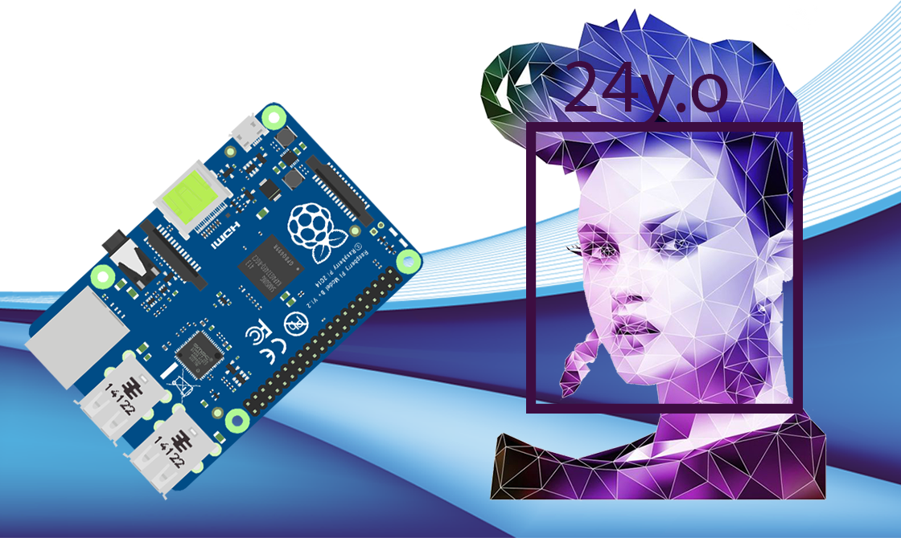
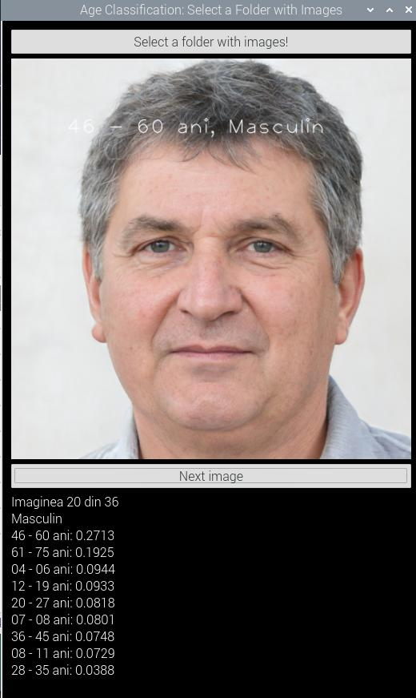
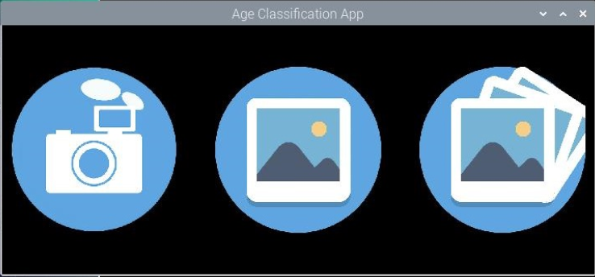

# Real-Time Age and Gender Classification on RaspberryPi4 using TFLite and PyQt5 Interface
Automatic age and gender classification in real-time, using Convolutional Neural Networks (based on MobileNet v1 network), fitted on Raspberry Pi 4 model using a converted .tflite model. The application is wrapped in a simple and modern UI using PyQt5.

<!--- See https://shields.io for customizable shields --->


<p align="center">
  
</p>

## Contents:
* [Demo](#Demo)
* [Screenshots](#Screenshots)
* [About this App](#AboutApp)
* [About the Model used](#AboutModel)
* [App main features](#AppFeatures)
* [Requirements and Versions Used](#Requirements)
* [Installation Process](#Installation)
* [Running the app](#RunApp)
* [License](#License)


## <a name="Demo"></a>Demo


## <a name="Screenshots"></a>Screenshots
<p float="left">
  
  
  
</p>
<p float="left">
  
  
  
</p>

* These images are downloaded from [ThisPersonDoesNotExist.com](https://thispersondoesnotexist.com). These people do not exist in reality, they were generated using a [Generative Adversarial Network - GAN](https://en.wikipedia.org/wiki/Generative_adversarial_network).

## <a name="AboutApp"></a>About this App
Automatic age and gender classification can be used in a large number of applications, especially in intelligent human-computer interfaces, as well as in biometrics, visual surveillance, limited access to multimedia content, and for commercial applications such as self-checkouts.

This app is proposed to be an optimal solution for the classification of age and gender in real-time, using a limited resource platform (Raspberry Pi 4 system), which does not have graphical acceleration. The app uses Convolutional Neural Networks (CNNs) in order to predict the classes. The network used is MobileNet v1 with 4 Million parameters, which is optimal in terms of resources used (compared to other CNN networks, see the table I made below).

|   ARCHITECTURE  | TOP 1 ACCURACY | NUMBER OF PARAMETERS | SIZE (MB) | YEAR |
|:---------------:|:--------------:|:--------------------:|:---------:|:----:|
| MobileNet-224   |      0.706     |          4M          |     16    | 2017 |
| Inception V1    |      0.698     |          5M          |           | 2014 |
| Inception V2    |      0.748     |          11M         |           | 2015 |
| Xception        |      0.790     |          22M         |     88    | 2016 |
| Inception V3    |      0.779     |          23M         |     92    | 2015 |
| ResNet-50       |      0.721     |          26M         |     98    | 2015 |
| AlexNet - 7CNNs |      0.633     |          60M         |           | 2012 |
| VGG-16          |      0.744     |         138M         |    528    | 2014 |
| VGG-19          |      0.745     |         144M         |    549    | 2014 |

This was a small part of my final project to obtain my Bachelor's Degree at Faculty of Electronics, UPB, Computer Science department. The final grade for the project was 10/10.


## <a name="AboutModel"></a>About the Model used
Classes used:
- 04 - 06 years old - _early childhood_
- 07 - 08 years old - _middle childhood_
- 09 - 11 years old - _late childhood_
- 12 - 19 years old - _adolescence_
- 20 - 27 years old - _early adulthood_
- 28 - 35 years old - _middle adulthood_
- 36 - 45 years old - _midlife_
- 46 - 60 years old - _mature adulthood_
- 61 - 75 years old - _late adulthood_
- female gender
- male gender


The model was trained using MobileNet v1 network using 10k images from UTKFace and Appa-Real databases, along with the following parameters:
- Optimizer: Stochastic Gradient Descent (SGD)
- Batch Size: 2
- Learning Rate: 10e-4
- Accuracy on test: 49.63%
- Accuracy on test with 2 years overlapping limits: 68.82%

<p float="left">
  
  
</p>


## <a name="AppFeatures"></a>App main features


The interface is simple to use, with only three buttons on the main menu:
* open the attached camera on the Raspberry Pi, which captures the frames in real-time and at the same time locates the human faces by drawing a square around them, classifying the person according to age and gender
* open a single picture in a local directory, for which the age and gender classification will be made automatically if there is a person in the picture
* select a local directory that contains only images, following that the user can view in cascade the classified images


## <a name="Requirements"></a>Prerequisites and Versions Used
* Raspberry Pi 3 or 4 or Any Linux System based on ARM chip with at least 512MB RAM.
* Python version 3.7 or higher
* PyQt5 version 5.11.3 or higher (usually pre-installed with Python)
* NumPy version 1.16.2 or higher
* TensorFlow version 1.15.0 and OpenCV version 3.4.3 (see [Installation Process](#Installation) below)

Notes for me (to find out these versions):
```bash
python3 --version
pip3 freeze # for numpy, tensorflow
python3 -c "import cv2; print(cv2.__version__)"
python3 -c "from PyQt5.Qt import PYQT_VERSION_STR; print(PYQT_VERSION_STR)"
python3 -c "import tensorflow as tf; print(tf.version.VERSION)"
```


## <a name="Installation"></a>Installation Process
- Install **NumPy**: `pip3 install numpy`.
- Install **Pillow** `pip3 install Pillow`.
- Install **OpenCV for Raspberry Pi** from [this tutorial](https://pysource.com/2018/10/31/raspberry-pi-3-and-opencv-3-installation-tutorial/). If error `undefined symbol __atomic_fetch_add_8 ` is encountered, try running `pip install opencv-contrib-python==3.4.3.18` or `pip install opencv-contrib-python==4.1.0.25`.
- Install **TensorFlow library** from [this tutorial](https://www.hackster.io/news/benchmarking-tensorflow-and-tensorflow-lite-on-the-raspberry-pi-43f51b796796).
```bash
git clone https://github.com/PINTO0309/Tensorflow-bin.git
cd Tensorflow-bin
pip3 install tensorflow-1.13.1-cp35-cp35m-linux_armv7l.whl
# test
python3 -c "import tensorflow as tf; tf.enable_eager_execution(); print(tf.reduce_sum(tf.random_normal([1000, 1000])))"
```
You can also refer to [TensorFlow Lite official guide](https://www.tensorflow.org/lite/guide/python).


## <a name="RunApp"></a>Running the app
Simply clone this repository then run using python3:
```bash
git clone https://github.com/radualexandrub/Age-Gender-Classification-on-RaspberryPi4-with-TFLite-PyQt5.git RaduApp
cd RaduApp
python3 AgeClass_MainApp.py
```
If git is not installed, run `sudo apt install git`.

## Find me on my Social's
***My portfolio:*** [radubulai.com](https://radualexandrub.github.io/)<br>
***My blog:*** [CodingTranquillity](https://codingtranquillity.herokuapp.com/)

<a href="https://github.com/radualexandrub" target="_blank"></a>&nbsp;&nbsp;
<a href="https://www.linkedin.com/in/radu-alexandru-bulai/" target="_blank"></a>&nbsp;&nbsp;
<a href="https://dev.to/radualexandrub" target="_blank"></a>&nbsp;&nbsp;
<a href="https://www.hackerrank.com/RaduAlexandruB" target="_blank"></a>&nbsp;&nbsp;
<a href="https://www.flickr.com/photos/radualexandru" target="_blank"></a>&nbsp;&nbsp;
<a href="https://www.mixcloud.com/radu-alexandru7" target="_blank"></a>&nbsp;&nbsp;

## <a name="License"></a>LICENSE
Copyright © 2020, [Radu-Alexandru Bulai](https://github.com/radualexandrub). Released under the [MIT license](LICENSE).
